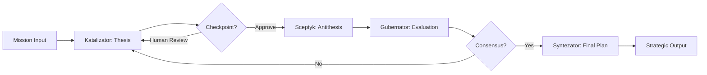

# 🤖 HEGEMON - Multi-Agent Dialectical Debate System

[](https://www.python.org/downloads/)
[](https://github.com/langchain-ai/langgraph)
[](https://opensource.org/licenses/MIT)
[](https://github.com/psf/black)
[](http://mypy-lang.org/)

> **English version below** | **Wersja polska poniżej**

---

## 🌟 What is HEGEMON?

**HEGEMON** is an advanced multi-agent AI system that uses **dialectical debate** (Thesis → Antithesis → Synthesis) to generate strategic plans. The system features **Human-in-the-Loop (HITL)** capabilities, allowing you to guide and refine the debate process in real-time.

### Key Features

- 🎭 **Dialectical Debate:** Four specialized AI agents engage in structured argumentation
- 🎯 **Multi-Provider LLM:** Supports Claude (Anthropic), Gemini (Google), GPT (OpenAI)
- 🤝 **Human-in-the-Loop:** Interactive checkpoints for human guidance and validation
- 🧠 **Explainability Layers:** Semantic fingerprinting and epistemic uncertainty tracking
- ☁️ **Cloud-Ready:** Works on Vertex AI, Google Colab, Kaggle, and local Jupyter
- 🔄 **Iterative Refinement:** Continues until consensus threshold is reached

---

## 🏗️ Architecture

### The Four Agents

```
┌─────────────────────────────────────────────────────────┐
│              HEGEMON Multi-Agent System                 │
├─────────────────────────────────────────────────────────┤
│                                                          │
│  🎨 Katalizator (Catalyst)                              │
│     └─ Claude Sonnet 4.5 - Creative thesis generation   │
│                                                          │
│  🔍 Sceptyk (Skeptic)                                   │
│     └─ Gemini 2.0 Pro - Critical analysis & antithesis  │
│                                                          │
│  ⚖️  Gubernator (Governor)                              │
│     └─ Claude Sonnet 4.5 - Evaluation & scoring         │
│                                                          │
│  🎯 Syntezator (Synthesizer)                            │
│     └─ Claude Sonnet 4.5 - Final plan synthesis         │
│                                                          │
└─────────────────────────────────────────────────────────┘
```

### Dialectical Flow



---

## 📊 Example Output

HEGEMON generates comprehensive strategic plans in JSON format:

```json
{
  "mission_overview": "Design ML pipeline for e-commerce company...",
  "required_agents": [
    {
      "role": "ML Platform Architect",
      "description": "Designs pipeline architecture, defines APIs...",
      "required_skills": ["MLflow", "Kubeflow", "API design"]
    }
  ],
  "workflow": [
    {
      "step_id": 1,
      "description": "Identify high-ROI use case with business metrics",
      "dependencies": []
    },
    {
      "step_id": 2,
      "description": "Set up minimal infrastructure: Airflow, MLflow",
      "dependencies": [1]
    }
  ],
  "risk_analysis": "KEY RISKS: (1) Timeline optimism (30% probability)..."
}
```

**See full example:** [`examples/sample_output.json`](examples/sample_output.json)

---

## 🚀 Quick Start

### Prerequisites

- Python 3.10 or higher
- API keys for LLM providers (Anthropic, Google, OpenAI)
- (Optional) Google Cloud account for Vertex AI

### 1. Installation

```bash
# Clone the repository
git clone https://github.com/Olga-Zydziak/Hegemon.git
cd Hegemon

# Create virtual environment
python3 -m venv venv
source venv/bin/activate  # On Windows: venv\Scripts\activate

# Install dependencies
pip install -r requirements.txt
```

### 2. Configuration

```bash
# Copy example environment file
cp .env.example .env

# Edit .env and add your API keys
nano .env
```

Required environment variables:
```bash
ANTHROPIC_API_KEY=your_claude_api_key
GOOGLE_API_KEY=your_gemini_api_key  # Or use Vertex AI (ADC)
OPENAI_API_KEY=your_openai_api_key
```

### 3. Run Your First Debate

**Option A: Command Line**

```bash
python main.py
```

**Option B: Jupyter Notebook**

```bash
jupyter notebook phase_2_4_example.ipynb
```

**Option C: Vertex AI / Colab**

Use the cloud-optimized version:
```bash
jupyter notebook vertex_ai_example.ipynb
```

### 4. Check Results

```bash
cat output/hegemon_output_*.json
```

---

## 💻 Usage Examples

### Basic Debate (No HITL)

```python
from hegemon.graph import create_hegemon_graph

# Create graph
graph = create_hegemon_graph()

# Define mission
initial_state = {
    "mission": "Design a customer service automation strategy for e-commerce...",
    "contributions": [],
    "cycle_count": 1,
    "current_consensus_score": 0.0,
    "final_plan": None,
}

# Execute debate
final_state = graph.invoke(initial_state)

# Access final plan
print(final_state["final_plan"].mission_overview)
```

### With Human-in-the-Loop (Local Jupyter)

```python
from hegemon.graph_hitl_v3 import create_hegemon_graph_hitl_v3
from hegemon.hitl import InterventionMode

# Create HITL-enabled graph
graph = create_hegemon_graph_hitl_v3(use_simple_ui=False)  # ipywidgets UI

initial_state = {
    "mission": "Design ML pipeline...",
    "contributions": [],
    "cycle_count": 1,
    "current_consensus_score": 0.0,
    "final_plan": None,
    # HITL configuration
    "intervention_mode": "collaborator",  # or "reviewer", "observer"
    "current_checkpoint": None,
    "human_feedback_history": [],
    "paused_at": None,
    "revision_count_per_checkpoint": {},
    "checkpoint_snapshots": {},
}

# Run - interactive checkpoints will appear!
final_state = graph.invoke(initial_state, config={"recursion_limit": 100})
```

### With Human-in-the-Loop (Vertex AI / Colab)

```python
from hegemon.graph_hitl_v3 import create_hegemon_graph_hitl_v3

# Use text-based UI for cloud environments
graph = create_hegemon_graph_hitl_v3(use_simple_ui=True)  # Works everywhere!

# ... same initial_state as above ...

# Run - you'll see text prompts instead of widgets
final_state = graph.invoke(initial_state)
```

**At checkpoints, you'll see:**
```
================================================================================
👤 YOUR FEEDBACK
================================================================================

Options:
  1 - ✅ Approve (continue with this output)
  2 - ✏️ Request Revision (provide guidance for improvement)
  3 - ❌ Reject (end debate - critical issue)

Enter your choice (1/2/3): █
```

---

## 📁 Project Structure

```
Hegemon/
├── hegemon/                    # Main package
│   ├── config/                # Agent configurations and prompts
│   ├── explainability/        # Semantic fingerprinting & epistemic tracking
│   ├── hitl/                  # Human-in-the-Loop components
│   │   ├── jupyter_ui.py      # ipywidgets-based UI (local Jupyter)
│   │   ├── simple_ui.py       # Text-based UI (Vertex AI/Colab)
│   │   ├── checkpoint_handler.py
│   │   └── review_package.py
│   ├── agents.py              # Agent logic (4 nodes)
│   ├── graph.py               # Base LangGraph orchestration
│   ├── graph_hitl_v3.py       # HITL-enhanced graph
│   └── schemas.py             # Pydantic data models
├── streamlit_app/             # Web UI (optional)
├── tests/                     # Unit and integration tests
├── examples/                  # Sample outputs and demos
├── main.py                    # Command-line entry point
├── phase_2_4_example.ipynb    # Jupyter tutorial (ipywidgets)
├── vertex_ai_example.ipynb    # Jupyter tutorial (cloud)
└── requirements.txt           # Dependencies
```

---

## 🧪 Testing

```bash
# Run all tests
pytest tests/ -v

# With coverage report
pytest tests/ -v --cov=hegemon --cov-report=html

# Type checking
mypy hegemon/ --ignore-missing-imports

# Code formatting
black hegemon/
ruff check hegemon/
```

---

## 🌍 Deployment Options

### Local Jupyter

```bash
jupyter notebook phase_2_4_example.ipynb
```

### Vertex AI JupyterLab

1. Upload `vertex_ai_example.ipynb` to your Vertex AI Workbench
2. Use `use_simple_ui=True` in graph creation
3. Follow notebook instructions

### Google Colab

1. Upload notebook to Colab
2. Install dependencies: `!pip install -r requirements.txt`
3. Use `use_simple_ui=True` for text-based UI

### Streamlit Web App

```bash
cd streamlit_app
streamlit run app.py
```

---

## 🔧 Advanced Configuration

### Change LLM Models

Edit `.env`:
```bash
HEGEMON_KATALIZATOR__MODEL=claude-3-opus-20240229
HEGEMON_SCEPTYK__MODEL=gemini-2.0-flash-exp
HEGEMON_GUBERNATOR__MODEL=claude-sonnet-4-5-20250929
```

### Adjust Debate Parameters

```bash
HEGEMON_CONSENSUS_THRESHOLD=0.8  # Higher = more cycles
HEGEMON_MAX_CYCLES=7             # Maximum debate rounds
```

### Enable Explainability

```bash
HEGEMON_EXPLAINABILITY_ENABLED=true
HEGEMON_EXPLAINABILITY_SEMANTIC_FINGERPRINT=true
```

---

## 📚 Documentation

- **Quick Start:** This README
- **HITL Tutorial (Local):** [`PHASE_2_4_INSTRUKCJA.md`](PHASE_2_4_INSTRUKCJA.md) (Polish)
- **HITL Tutorial (Cloud):** [`VERTEX_AI_README.md`](VERTEX_AI_README.md)
- **Code Review:** [`CODE_REVIEW_FOR_RECRUITERS.md`](CODE_REVIEW_FOR_RECRUITERS.md)
- **Example Notebooks:**
  - [`phase_2_4_example.ipynb`](phase_2_4_example.ipynb) - ipywidgets version
  - [`vertex_ai_example.ipynb`](vertex_ai_example.ipynb) - cloud version

---

## 🤝 Contributing

This is a research project. Contributions, issues, and feature requests are welcome!

---

## 📝 License

This project is licensed under the MIT License.

---

## 👥 Author

**Olga Żydziak**

- Created as part of ML/AI systems research
- Demonstrates: Multi-agent systems, Human-in-the-Loop, LLM orchestration
- Technologies: Python, LangGraph, Pydantic, Multi-provider LLMs

---

## 🙏 Acknowledgments

- Built with [LangGraph](https://github.com/langchain-ai/langgraph) for agent orchestration
- Uses Claude (Anthropic), Gemini (Google), and GPT (OpenAI) models
- Inspired by dialectical reasoning and collaborative AI systems

---

---

---

# 🇵🇱 Wersja Polska

## 🌟 Czym jest HEGEMON?

**HEGEMON** to zaawansowany system wieloagentowy AI wykorzystujący **debatę dialektyczną** (Teza → Antyteza → Synteza) do generowania strategicznych planów. System posiada funkcjonalność **Human-in-the-Loop (HITL)**, pozwalającą na prowadzenie i udoskonalanie procesu debaty w czasie rzeczywistym.

### Kluczowe Funkcje

- 🎭 **Debata Dialektyczna:** Czterech wyspecjalizowanych agentów AI angażuje się w strukturalną argumentację
- 🎯 **Multi-Provider LLM:** Obsługa Claude (Anthropic), Gemini (Google), GPT (OpenAI)
- 🤝 **Human-in-the-Loop:** Interaktywne checkpointy dla ludzkiego nadzoru i walidacji
- 🧠 **Warstwy Explainability:** Semantic fingerprinting i śledzenie niepewności epistemicznej
- ☁️ **Cloud-Ready:** Działa na Vertex AI, Google Colab, Kaggle i lokalnym Jupyter
- 🔄 **Iteracyjne Udoskonalanie:** Kontynuuje aż do osiągnięcia progu konsensusu

---

## 🚀 Szybki Start (Polski)

### 1. Instalacja

```bash
# Sklonuj repozytorium
git clone https://github.com/Olga-Zydziak/Hegemon.git
cd Hegemon

# Stwórz środowisko wirtualne
python3 -m venv venv
source venv/bin/activate  # Windows: venv\Scripts\activate

# Zainstaluj zależności
pip install -r requirements.txt
```

### 2. Konfiguracja

```bash
# Skopiuj przykładowy plik konfiguracyjny
cp .env.example .env

# Edytuj .env i dodaj swoje klucze API
nano .env
```

Wymagane zmienne środowiskowe:
```bash
ANTHROPIC_API_KEY=twoj_klucz_claude
GOOGLE_API_KEY=twoj_klucz_gemini  # Lub użyj Vertex AI
OPENAI_API_KEY=twoj_klucz_openai
```

### 3. Uruchom Pierwszą Debatę

**Opcja A: Linia poleceń**

```bash
python main.py
```

**Opcja B: Jupyter Notebook**

```bash
jupyter notebook phase_2_4_example.ipynb
```

**Opcja C: Vertex AI / Colab**

Użyj wersji zoptymalizowanej dla chmury:
```bash
jupyter notebook vertex_ai_example.ipynb
```

### 4. Sprawdź Wyniki

```bash
cat output/hegemon_output_*.json
```

---

## 📁 Struktura Projektu

```
Hegemon/
├── hegemon/                    # Główny pakiet
│   ├── config/                # Konfiguracja agentów i prompty
│   ├── explainability/        # Semantic fingerprinting & epistemic tracking
│   ├── hitl/                  # Komponenty Human-in-the-Loop
│   │   ├── jupyter_ui.py      # UI z ipywidgets (lokalne Jupyter)
│   │   ├── simple_ui.py       # UI tekstowe (Vertex AI/Colab)
│   │   ├── checkpoint_handler.py
│   │   └── review_package.py
│   ├── agents.py              # Logika agentów (4 węzły)
│   ├── graph.py               # Bazowa orkiestracja LangGraph
│   ├── graph_hitl_v3.py       # Graf z HITL
│   └── schemas.py             # Modele danych Pydantic
├── streamlit_app/             # Web UI (opcjonalne)
├── tests/                     # Testy jednostkowe i integracyjne
├── examples/                  # Przykładowe outputy i dema
├── main.py                    # Punkt wejścia CLI
├── phase_2_4_example.ipynb    # Tutorial Jupyter (ipywidgets)
├── vertex_ai_example.ipynb    # Tutorial Jupyter (cloud)
└── requirements.txt           # Zależności
```

---

## 🧪 Testowanie

```bash
# Uruchom wszystkie testy
pytest tests/ -v

# Z raportem pokrycia
pytest tests/ -v --cov=hegemon --cov-report=html

# Sprawdzanie typów
mypy hegemon/ --ignore-missing-imports

# Formatowanie kodu
black hegemon/
ruff check hegemon/
```

---

## 📚 Dokumentacja (Polski)

- **Szybki Start:** Ten README
- **Tutorial HITL (Lokalne):** [`PHASE_2_4_INSTRUKCJA.md`](PHASE_2_4_INSTRUKCJA.md)
- **Tutorial HITL (Chmura):** [`VERTEX_AI_README.md`](VERTEX_AI_README.md)
- **Code Review:** [`CODE_REVIEW_FOR_RECRUITERS.md`](CODE_REVIEW_FOR_RECRUITERS.md)
- **Przykładowe Notebooki:**
  - [`phase_2_4_example.ipynb`](phase_2_4_example.ipynb) - wersja z ipywidgets
  - [`vertex_ai_example.ipynb`](vertex_ai_example.ipynb) - wersja dla chmury

---

## 📝 Licencja

Projekt jest dostępny na licencji MIT.

---

## 👥 Autorka

**Olga Żydziak**

- Stworzony jako część badań nad systemami ML/AI
- Demonstracja: Systemy wieloagentowe, Human-in-the-Loop, orkiestracja LLM
- Technologie: Python, LangGraph, Pydantic, Multi-provider LLMs

---
